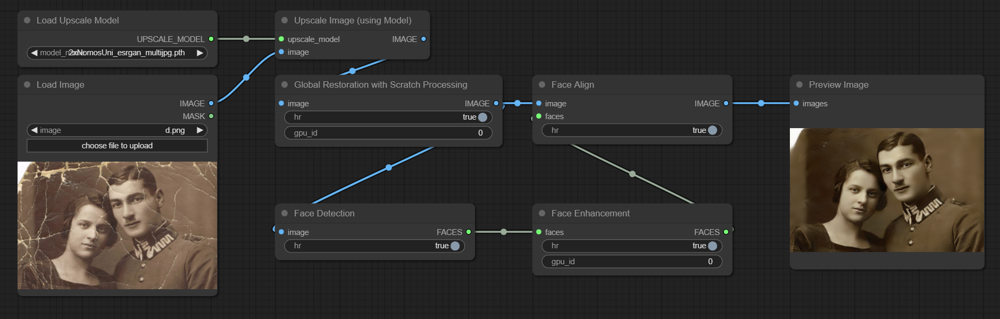

# ComfyUI Old Photo Restoration
This is an Extension for [ComfyUI](https://github.com/comfyanonymous/ComfyUI), which allows you to perform **Bringing-Old-Photos-Back-to-Life** natively.

<p align="center">
<br>
<code>example workflow</code><br>
<i>(You can drag this image directly into ComfyUI)</i>
</p>

> Original Paper: https://arxiv.org/abs/2004.09484

> Original Repo: https://github.com/microsoft/Bringing-Old-Photos-Back-to-Life *(includes some example images)*

## Installation

1. Install this Custom Node using the [ComfyUI-Manager](https://github.com/Comfy-Org/ComfyUI-Manager)
2. Locate the installation folder of this Custom Node
```bash
cd ~ComfyUI\custom_nodes\comfyui-old-photo-restoration
```
3. Verify whether the `lib_bopb2l` folder exists or not
4. If not, download the `backend.zip` from [Releases](https://github.com/Haoming02/comfyui-old-photo-restoration/releases)
5. Then extract the `lib_bopb2l` folder into this Custom Node

## Prerequisite
0. [Install](#installation) as instructed above
1. Download `global_checkpoints.zip` from [Releases](https://github.com/Haoming02/sd-webui-old-photo-restoration/releases)
2. Extract and put the `checkpoints` **folder** *(not just the files)* into `~ComfyUI/custom_nodes/comfyui-old-photo-restoration/lib_bopb2l/Global`
3. Download `face_checkpoints.zip` from [Releases](https://github.com/Haoming02/sd-webui-old-photo-restoration/releases)
4. Extract and put the `checkpoints` **folder** *(not just the files)* into `~ComfyUI/custom_nodes/comfyui-old-photo-restoration/lib_bopb2l/Face_Enhancement`
5. Download `shape_predictor_68_face_landmarks.zip` from [Releases](https://github.com/Haoming02/sd-webui-old-photo-restoration/releases)
6. Extract the `.dat` **file** into `~ComfyUI/custom_nodes/comfyui-old-photo-restoration/lib_bopb2l/Face_Detection`

> The [Releases](https://github.com/Haoming02/sd-webui-old-photo-restoration/releases) page includes the original links, as well as the backups mirrored by myself

> Another mirror: [Google Drive](https://drive.google.com/drive/folders/1CXAgAYQzz_JkMmxqcabvgGhG_msyMkyS)

## How to Use
Simply connect an `image` to the `Global Restoration` node to process; if the `image` contains scratch artifacts, use the `Global Restoration with Scratch Processing` node instead.

To improve the faces, connect the `image` to the `Face Detection` node then the `Face Enhancement` node, then connect the enhanced output and the `image` both to the `Face Align` node in the end to merge the results.

#### Settings
- **HR:** Use some higher parameters during the processings
- **GPU_ID:** Specify the GPU to use
    - Set it to `-1` to use CPU if you do not have a Nvidia GPU or are getting Out of Memory Error
